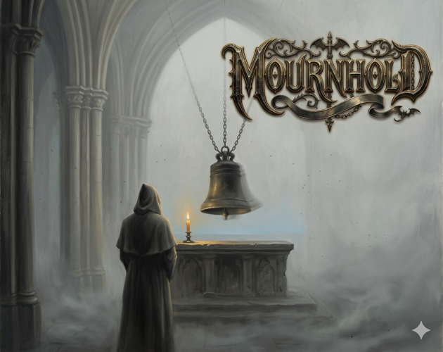

<p align="center">
  
</p>

# Mournhold

> *A hermetic, terminal-based grimdark roguelike RPG. Pure Python 3, no runtime
> dependencies, no graphics. Just text, ANSI colour, and the writing earning
> its keep.*

---

## The Kingdom

Mournhold is a kingdom dying because it tried to forget.

There was a famine winter, long ago, when the capital sealed its gates and let
the outer holds starve. Then the kingdom convened, in full ceremony, and
performed a true kingdom-wide rite of *unremembering*. It worked. But a
forgotten thing still exists; denied a keeper, it began to hold itself, and
grew hungry for the one cell it had escaped — **memory**.

That is **the Pall**. The kingdom's own forgetting, grown vast and starving,
come back down the heights to un-remember the world entire.

The last road that leads anywhere climbs into it.

You climb.

## The Climb

You start at **the Crossroads** and walk a journey-chain of named zones —
each a stage of the dying kingdom and a facet of one idea — ending at the
**Shrouded Summit**. Every region restores one buried truth. The climb is an
act of *remembering*.

At the Summit waits the previous climber, kept by the Pall: the **Shadow
Warden**. The hero who breaks them is kept in turn. The Pall keeps whoever
has proven they can carry a terrible weight and still stand. You never defeat
the Pall. You volunteer, unknowing, to become its memory.

This is canon. The climb knows it. So, eventually, do you.

## The Systems That Make the Climb Heavy

**The Chronicle of the Fallen** — Mournhold remembers your dead between
runs. Their bones rise as **the Hollowed** in the zones where they fell. The
hero who breaks the Warden becomes the next Warden, and the climber after
them — you again, the next character — faces themselves at the Summit. Every
previous character leaves traces the next can find: a marginalia hand in a
discovery, a Hollowed who recognises your walk, a pendant in your pack, a
Chronicle line in your own handwriting.

**The Marks** — 1000 irreversible per-character moments that fire as you
walk, fight, save, and grow. The smith's thumbprint kept on your weapon's
grip. A grief Atrél held briefly at the side altar. A face the Pall took
from your memory. A friend's old camp-mark recognised in the wild. Many
marks change your stats; all are written to disk before the narrative shows.
Reloading cannot undo a mark that fired — per-run sidecar files keep them.
*Only this character* gets them. The next character starts un-marked.

**The Classes** — Warrior, Rogue, Mage, Ranger, Cleric. Each fights
differently and picks up its own marks. The kingdom marks you partly by who
you chose to be.

**The Endings** — multiple, paid for in what you did and didn't do across
runs. Becoming the next Warden. Laying the Hollowed to rest. Sealing the
kingdom's old wrong. Purifying the realm after enough cleanses. The hidden
final truth that only the most thorough climber finds. Each ending is a
different kind of carrying.

## Play

```bash
python3 rpg.py            # the historical entry point
python3 -m terminalquest  # equivalent
```

Python 3.9+ is the only requirement. Save slots and the Chronicle live
under `~/.terminalquest/`. Mark sidecars live next to them.

Prebuilt binaries for Windows, macOS (Apple Silicon), and Linux are at
**[abidlebob.itch.io/mournhold](https://abidlebob.itch.io/mournhold)**.

## Develop

```bash
pip install -e ".[dev]"           # pytest + ruff — the only dev deps
python3 -m pytest                 # the full test suite
ruff check .                      # lint (line length 100)
python3 -m tools.sim              # the balance simulator
python3 -m tools.sim --check      # the CI balance regression gate
```

Content lives in **JSON**, not Python. `terminalquest/data/` holds the
classes, abilities, enemies, the location graph, the marks, the discoveries.
Tuning the game does not require touching code — adding a zone, an enemy, an
NPC, or a mark is editing a file. `Content.validate()` checks internal
consistency on every load; bad references fail fast.

## How the Engine Is Shaped

A single `GameState` carries the player, the loaded content, the IO channel,
the RNG, the current location, and a `flags` dict. There is no central event
loop — only a nested input loop in `location_loop` that dispatches to typed
encounters. The IO and the RNG are both *injected*, which is the trick that
lets every fight and every conversation run headlessly under pytest.

`tools/sim` is the balance simulator: it plays the game a few hundred times
in silence and reports the win-rate of each class against a committed
baseline. CI fails if any class drifts outside the band. New content that
changes the balance is welcome — it updates the baseline in the same commit.

Marks ride their own small engine in `terminalquest/marks.py`. Six fire-sites
(`zone_arrival`, `combat_victory`, `combat_low_hp`, `save_action`,
`discovery_read`, `level_up`); a two-stage roll (per-site base rate, then
weighted pick from the eligible pool); gates on level, location, visit count,
class, and arbitrary flags; per-run sidecars at
`~/.terminalquest/marks/{run_id}.json` so reloads cannot un-mark you.

The codebase is **hermetic by design**: no runtime dependencies beyond the
standard library. `pytest` and `ruff` are dev-only. The game runs the same
on a fresh Python install with nothing else on the system — which is the
point of a kingdom you can carry around in your terminal.

## The Other Documents

- **[ROADMAP.md](ROADMAP.md)** — the multi-year build plan; where the kingdom
  is going next.
- **[CLAUDE.md](CLAUDE.md)** — architecture in detail; conventions; where
  every system lives. Read this if you are going to touch code.

## A Note on the Writing

The kingdom carries its own voice — particular, slow, a kind of careful
grimdark that takes its dead seriously and is, sometimes, kinder than you
expect. The marks were written that way. The discoveries were written that
way. The endings were written that way. If you add content, keep the voice:
the kingdom marks the player by paying attention, not by shouting.

---

*You walk Mournhold once. The kingdom keeps you. Walk well.*
